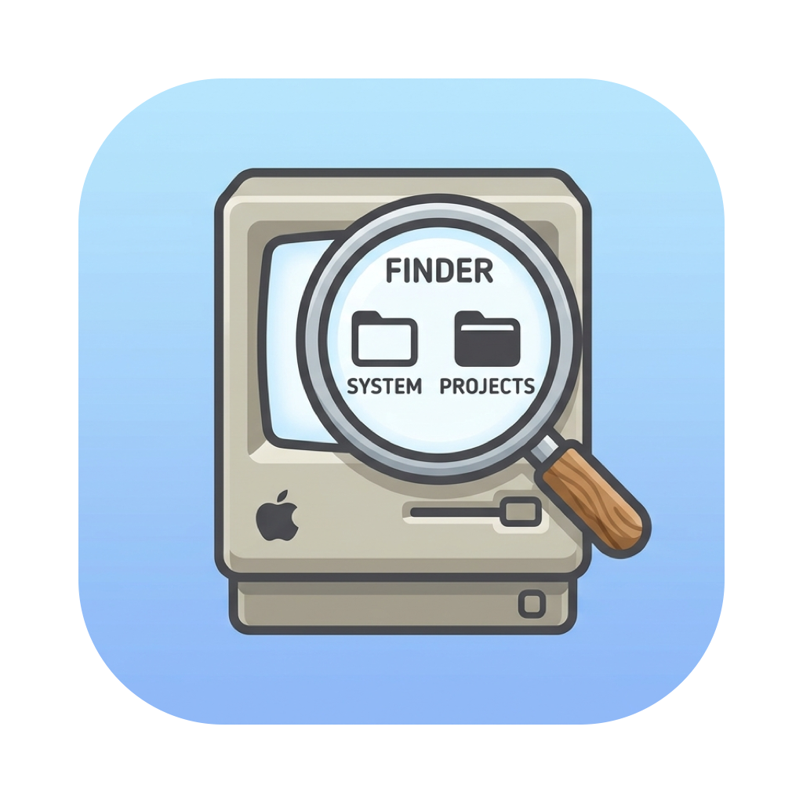

<p align="center">
  
</p>

<h1 align="center">ZoomIt4Mac</h1>

<p align="center">
  A native macOS re-implementation of the Sysinternals
  <a href="https://learn.microsoft.com/sysinternals/downloads/zoomit">ZoomIt</a>
  presentation tool — screen zoom and annotation from your menu bar.
</p>

<p align="center">
  
  
  
</p>

---

## Features

- **Zoom** (`⌃1`) — freezes the screen and smoothly zooms in on the mouse position. Move the mouse to pan (every screen edge reachable at any zoom level), scroll / pinch / `↑` `↓` to change magnification (1×–8×). Right-click, Esc, or `⌃1` exits.
- **Live Zoom** (`⌃4`) — like Zoom, but the magnified screen keeps updating (video, demos). Same pan/zoom controls; left-click freezes the current frame for annotation, Esc returns to live. Active display only.
- **Draw** (`⌃2`, or left-click while zoomed) — annotate the screen or the frozen zoomed image:

  | Input | Action |
  |---|---|
  | drag | freehand pen |
  | `⇧`-drag / `⌃⇧`-drag | straight line / arrow |
  | `⌃`-drag / hold `Tab`+drag | rectangle / ellipse |
  | `R` `G` `B` `O` `Y` `P` | pen color |
  | `⌘`-scroll | pen width |
  | `⌘Z` or right-click | undo |
  | `E` | erase all |
  | `W` / `K` | whiteboard / blackboard |
  | `H` | highlighter pen (toggle) |
  | `X` | blur pen — drag a rectangle to blur (zoomed image only) |
  | `⌘S` / `⌘C` | save PNG / copy to clipboard |
  | `Esc` | back to zoom, or exit |

  Exports capture the screen as you see it — desktop (or frozen zoom, or board) with your annotations on top.
- **Type** (`T` while drawing) — click to place the caret and type on screen. `⌘+` / `⌘−` adjust font size, Esc finishes.
- **Break Timer** (`⌃3`) — full-screen countdown for presentation breaks. `Space` pauses, `↑` `↓` or scroll adjusts by a minute, Esc ends. Configurable duration (1–99 min), position, opacity, and background (solid black, faded desktop, or an image); optional sound and elapsed-time display on expiry.
- **Screen Recording** (`⌃5`) — records the active display to `~/Movies/ZoomIt4Mac/` (.mp4, revealed in Finder when done; HEVC by default for ~50% smaller files, H.264 selectable in Settings for maximum compatibility). A brief on-screen notice announces the start (press `⌃5` again during it to cancel); capture begins after it disappears, so the notice is never in your video. Your zoom and draw annotations are part of the recording. Optional microphone and system-audio capture (Settings → Recording); works while any other mode is active.
- **Snip** (`⌃6`) — freezes the screen, then drag to select a region; releasing copies it to the clipboard (hold `⌥` while releasing to also save it as a PNG). Esc or right-click cancels.
- **Settings** — rebind the hotkeys (with conflict detection), default zoom level, pen defaults, recording audio/codec, automatic update checks, launch at login.

Menu bar app (`LSUIElement`) — no Dock icon.

## Permissions

Zoom, Live Zoom, Snip, and Screen Recording require **Screen Recording** permission (System Settings → Privacy & Security → Screen & System Audio Recording). Draw and Type work without it. No Accessibility permission is required. Recording with the microphone enabled additionally asks for **Microphone** permission (optional — recordings proceed without it if denied).

## Install

```sh
brew install TechPreacher/tap/zoomit4mac
```

Or grab the notarized `.dmg` (or zip) from the [latest release](https://github.com/TechPreacher/ZoomIt4Mac/releases/latest) and drag `ZoomIt4Mac.app` into `/Applications`.

The app keeps itself up to date via [Sparkle](https://sparkle-project.org) — it checks automatically (toggle in Settings → Updates) and on demand via "Check for Updates…" in the menu.

## Building

Requires Xcode 16+ and [XcodeGen](https://github.com/yonaskolb/XcodeGen):

```sh
brew install xcodegen
xcodegen                # generates ZoomIt4Mac.xcodeproj (not committed)
xcodebuild -project ZoomIt4Mac.xcodeproj -scheme ZoomIt4Mac build
xcodebuild -project ZoomIt4Mac.xcodeproj -scheme ZoomIt4Mac test -destination 'platform=macOS'
```

## Architecture

- **`ZoomItCore`** — pure-Swift framework: session state machine, zoom geometry, annotation model, hotkey/settings models. No AppKit; fully covered by headless [Swift Testing](https://developer.apple.com/documentation/testing) tests.
- **`ZoomIt4Mac`** — thin AppKit shell: overlay windows, ScreenCaptureKit capture, Carbon global hotkeys, SwiftUI settings.

Design and plan documents live under [`docs/`](docs/).

## Release

`scripts/release.sh` archives, exports with Developer ID, notarizes, and staples a distributable zip and a drag-to-Applications `.dmg` (the DMG contains the stapled app plus an `/Applications` symlink and is itself signed, notarized, and stapled). See the script header for one-time credential setup.

The script also regenerates the [Sparkle](https://sparkle-project.org) update feed (`appcast.xml`, EdDSA-signed with the key in the release machine's login Keychain — one-time setup in the script header).

Cutting a release:

1. Bump `MARKETING_VERSION` **and** `CURRENT_PROJECT_VERSION` in `project.yml`, commit. (Sparkle compares `CFBundleVersion` — skipping the `CURRENT_PROJECT_VERSION` bump makes the update invisible to existing installs.)
2. `bash scripts/release.sh` → produces `build/ZoomIt4Mac-notarized.zip`, `build/ZoomIt4Mac.dmg`, `build/appcast/ZoomIt4Mac-X.Y.Z.zip`, and an updated `appcast.xml`; note the `shasum -a 256` of the zip (the cask pins it).
3. Tag and publish (the release **must** be live before the appcast lands on `main` — the feed must never point at a missing asset):
   ```sh
   git tag vX.Y.Z && git push origin vX.Y.Z
   cp build/ZoomIt4Mac.dmg build/ZoomIt4Mac-X.Y.Z.dmg
   gh release create vX.Y.Z build/appcast/ZoomIt4Mac-X.Y.Z.zip build/ZoomIt4Mac-X.Y.Z.dmg \
     --title "ZoomIt4Mac X.Y.Z" --notes "..."
   git add appcast.xml && git commit -m "Update appcast for X.Y.Z" && git push origin main
   ```
4. Update `version` and `sha256` in [`TechPreacher/homebrew-tap`](https://github.com/TechPreacher/homebrew-tap)'s `Casks/zoomit4mac.rb` (which declares `auto_updates true`), push.

The marketing site at [zoomit4mac.corti.com](https://zoomit4mac.corti.com) is the static page in [`site/`](site/) — deploy by copying its contents to the web server. Download links resolve the latest GitHub release automatically; no per-release site update needed.

## Acknowledgements

ZoomIt is a [Sysinternals](https://learn.microsoft.com/sysinternals/) tool by Mark Russinovich; ZoomIt and Sysinternals are trademarks of Microsoft Corporation. This project is an independent re-implementation for macOS and is not affiliated with or endorsed by Microsoft.

## License

[MIT](LICENSE)
